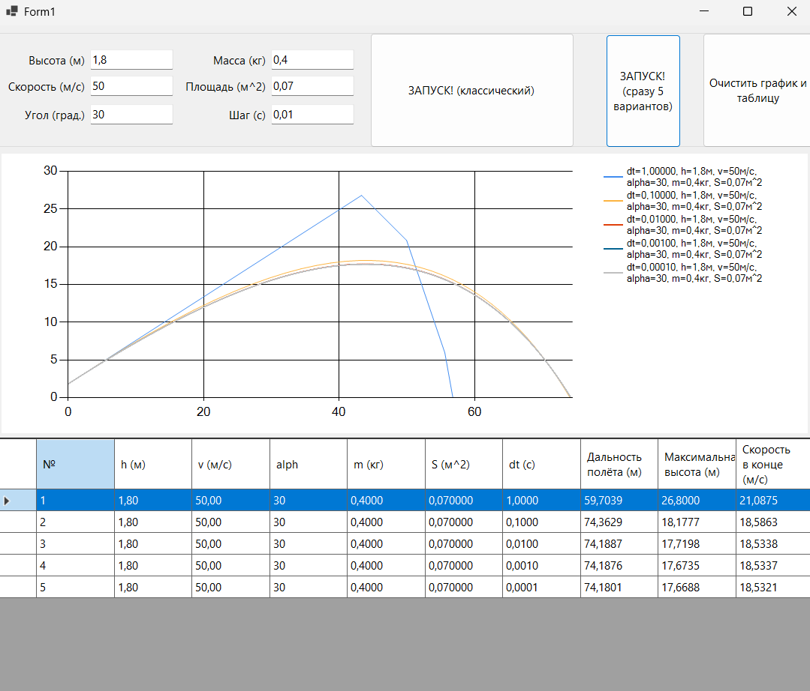

# Моделирование полёта тела в атмосфе
* Задание:

Реализовать приложение для моделирования полёта тела в атмосфере.
Предусмотреть возможность ввода шага моделирования и вывода результатов.

рисунок 1. Пример моделирования полёта тела в атмосфере с различным шагом модельного времени

При шаге интегрирования dt ≤ 0,01 с траектория становится физически достоверной, а дальнейшее уменьшение шага лишь неоправданно увеличивает время расчёта без заметного прироста точности. Для защиты от некорректных данных добавлена валидация: программа блокирует запуск при отрицательных значениях параметров или угле вне диапазона [-90°; 90°].

