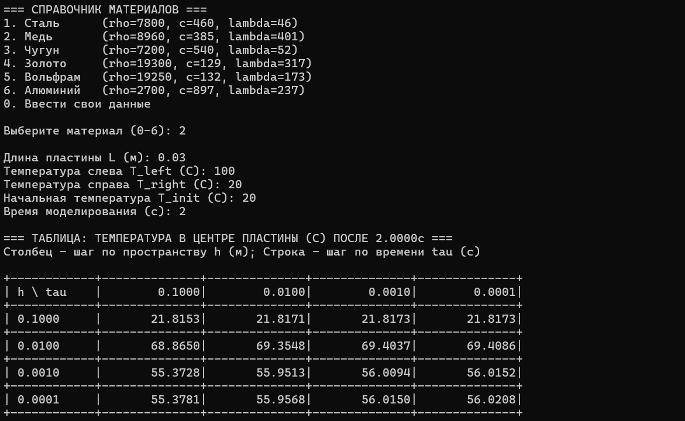

### Метод конечных разностей для уравнения теплопроводности

**Задание:**  
Реализовать моделирование изменения температуры в пластине на основе одномерного уравнения теплопроводности с использованием метода конечных разностей.
Выполнить моделирование с различными шагами по времени и по пространству.  
Заполнить таблицу значений температуры в центральной точке пластины после 2 секунд модельного времени.

**Вывод:**
Использование слишком крупного шага по пространству (\(h = 0.1\) м) приводит к физически недостоверным результатам из-за недостаточного разрешения сетки. При уменьшении \(h\) до 0.001 м наблюдается сходимость решения: температура в центре стабилизируется около \(56.0^\circ\)C. Шаг по времени \(\tau\) влияет слабее, однако его уменьшение с 0.1 до 0.001 с уточняет результат примерно на \(0.6^\circ\)C. Оптимальным балансом точности и вычислительных затрат является сочетание \(h = 0.001\) м и \(\tau = 0.001\) с. Дальнейшее измельчение шагов не приводит к значимому изменению температуры, но увеличивает время расчёта.