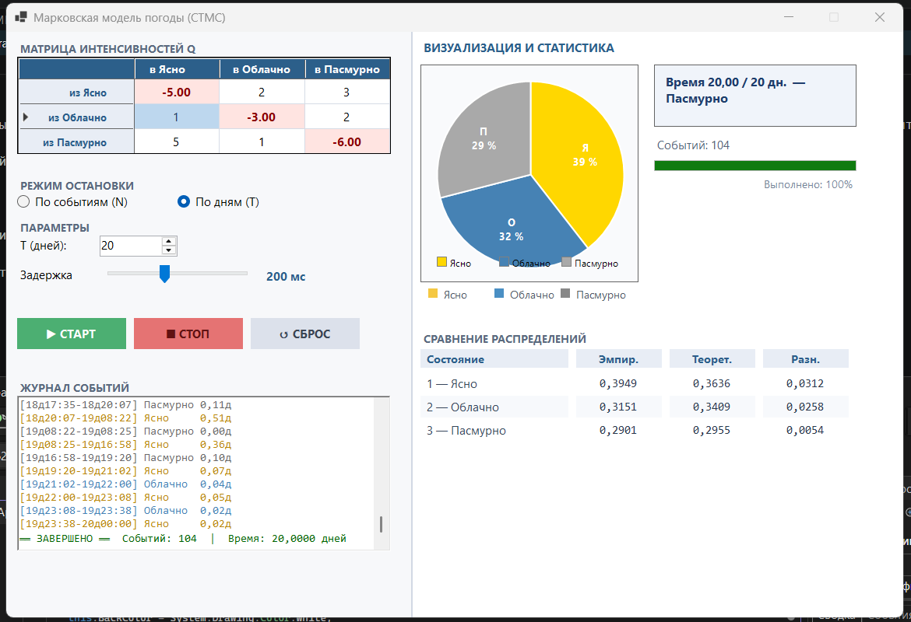

### Марковская модель погоды

**Задание:**  
Смоделировать погоду по дням:

- 1 — ясно  
- 2 — облачно  
- 3 — пасмурно  

Единица времени — **1 день**.  
Задать интенсивности переходов между состояниями.

**Требования:**
1. Выполнить моделирование в «реальном» времени с визуализацией.
2. Провести статистическую обработку результатов.
3. Сравнить эмпирическое распределение с теоретическим стационарным.
4. Сбор статистики и всей необходимой информации в .txt или .csv формат (.csv формат предпочтительней)

## Используемые алгоритмы

Моделирование основано на генерации случайных интервалов времени между сменами погодных состояний.  
Длительность пребывания в каждом состоянии вычисляется по экспоненциальному закону с параметром, равным сумме интенсивностей выхода из данного состояния (значения берутся из матрицы интенсивностей $Q$).  
Когда время в состоянии истекает, программа выбирает новое состояние с вероятностью, пропорциональной соответствующим интенсивностям перехода.

Для генерации псевдослучайных чисел реализован **мультипликативный конгруэнтный метод** (LCG) с подобранными параметрами, обеспечивающий равномерное распределение на интервале $(0,1)$.

Финальные (стационарные) вероятности состояний вычисляются двумя способами:
- **Теоретически** – решением системы линейных уравнений $\pi Q = 0$ при условии нормировки $\sum \pi_i = 1$. Используется метод Крамера (вычисление определителей через разложение по строке/столбцу).
- **Эмпирически** – накоплением долей времени, проведённого в каждом состоянии в процессе симуляции.

## Результаты моделирования

Пример работы программы для матрицы интенсивностей $Q$ и общего времени $T = 20$ дней:

| Состояние | Эмпирическая вероятность | Теоретическая вероятность | Абсолютная погрешность |
| :---      | :---:                     | :---:                      | :---:                   |
| **Ясно**    | 0.3949                     | 0.3636                      | 0.0312                   |
| **Облачно** | 0.3151                     | 0.3409                      | 0.258                   |
| **Пасмурно**| 0.2901                     | 0.2955                      | 0.0054                   |

Наблюдается сходимость эмпирических данных к теоретическим – при увеличении времени моделирования погрешности уменьшаются.

## Интерфейс приложения

Приложение реализовано на **Windows Forms** с использованием `DataGridView`, `TrackBar`, `RichTextBox` и пользовательского элемента для круговой диаграммы.

**Основные элементы интерфейса:**

- **Левая панель**:
  - Таблица для ввода матрицы интенсивностей $Q$ (диагональные элементы вычисляются автоматически как $- \sum_{j \neq i} q_{ij}$).
  - Выбор режима остановки:  
    - *По количеству событий* (N переходов)  
    - *По модельным дням* (T)
  - Ползунок задержки для регулировки скорости анимации (0–500 мс).
  - Кнопки управления: **Старт**, **Стоп**, **Сброс**.
  - Журнал событий с отображением каждого перехода и текущего времени.

- **Правая панель**:
  - Круговая диаграмма (визуализация текущего распределения состояний).
  - Карточка текущего состояния, модельного времени и прогресс-бар выполнения.
  - Таблица сравнения эмпирических и теоретических вероятностей с автоматическим обновлением в реальном времени (или по окончании моделирования).

## Вывод

В ходе лабораторной работы разработана и реализована модель марковского процесса с непрерывным временем применительно к смене погодных условий.  
Ключевое отличие от цепей с дискретным временем – возможность наступления переходов в любой момент времени и экспоненциальное распределение длительности пребывания в состоянии.

Сравнение эмпирических результатов, полученных в процессе имитационного моделирования, с теоретическими стационарными вероятностями (решением системы $\pi Q = 0$) показало сходимость результатов.