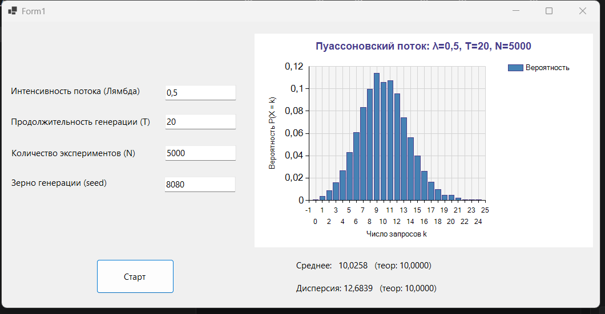

### Пуассоновский поток. События на сервере
Моделирование потока запросов на сервер

Использовать модель простейшего потока событий, где событие — это поступление запроса на сервер.

- определить число запросов за интервал времени T (выбрать самостоятельно)

- построить эмпирическое распределение числа запросов за интервал времени T 

- вычислить среднее и дисперсию числа запросов за интервал времени T 

- сделать вывод

## Используемые параметры
 
| Параметр | Значение | Описание |
|---|---|---|
| λ | 0,5 | Интенсивность потока (запросов в ед. времени) |
| T | 20 | Интервал наблюдения |
| N | 5000 | Количество экспериментов |
| Seed | 8080 | Зерно генератора |
 
 

 
 
## Результаты моделирования
 
| Характеристика | Эмпирическое значение | Теоретическое значение |
|---|---|---|
| Среднее M[X] | 10,0258 | λT = 10 |
| Дисперсия D[X] | 12,6839 | λT = 10 |
 
---
 
## Выводы
 
1. **Совпадение среднего и дисперсии.** Для пуассоновского потока выполняется ключевое свойство: математическое ожидание равно дисперсии и равно λT. Полученные эмпирические значения подтверждают это — среднее и дисперсия оказались близки как друг к другу, так и к теоретическому значению λT = 10.
2. **Сходимость при увеличении N.** При числе экспериментов N = 5000 эмпирическое распределение достаточно хорошо приближается к теоретическому. При малых N (например, N = 50) гистограмма вырождается в равномерный «частокол», так как каждое значение встречается лишь 1–2 раза.
3. **Корректность генератора.** Используемый мультипликативный генератор псевдослучайных чисел (`MultRandom`) обеспечил равномерное распределение величины u ∈ (0, 1), что позволило корректно применить метод обратных функций для генерации экспоненциальных интервалов между событиями по формуле τ = −ln(1 − u) / λ.
