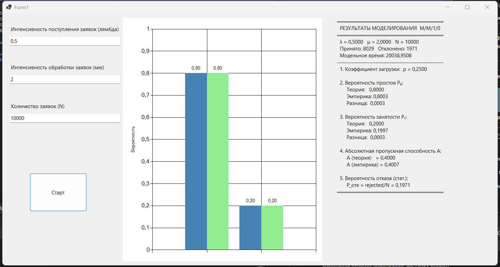

### Система массового обслуживания M/M/1/0
Моделирование одноканальной СМО с потерями (без очереди)

Использовать метод следующего события для моделирования системы массового обслуживания M/M/1/0, где:
- простейший входящий поток с интенсивностью λ
- время обслуживания распределено экспоненциально с параметром μ
- один сервер, очередь отсутствует (заявка получает отказ, если сервер занят)

- определить эмпирические вероятности состояний P₀ (сервер свободен) и P₁ (сервер занят)
- вычислить абсолютную пропускную способность системы
- сравнить эмпирические значения с теоретическими
- сделать вывод о корректности моделирования

## Используемые параметры
 
| Параметр | Значение | Описание |
|---|---|---|
| λ | 0,5 | Интенсивность поступления заявок |
| μ | 2 | Интенсивность обслуживания |
| N | 10000 | Количество моделируемых заявок |
| Seed | ticks | Зерно генератора (текущее время) |
 
 

 
 
## Результаты моделирования
 
| Характеристика | Эмпирическое значение | Теоретическое значение |
|---|---|---|
| Коэффициент загрузки ρ | 0,25 | λ/μ = 0,25 |
| Вероятность простоя P₀ | 0,8 | 1/(1+ρ) = 0,8 |
| Вероятность занятости P₁ | 0,2 | ρ/(1+ρ) = 0,2 |
| Абсолютная пропускная способность A | 0,4 | λ·P₀ = 0,4 |
| Вероятность отказа P_отк | 0,1971 | P₁ = 0,1971 |
 
---
 
## Выводы
 
1. **Совпадение теории и практики.** Для системы M/M/1/0 эмпирические вероятности состояний P₀ и P₁, полученные методом статистического моделирования, хорошо согласуются с теоретическими значениями, вычисленными по формулам: P₀ = 1/(1+ρ) и P₁ = ρ/(1+ρ). Разница между теорией и эмпирикой не превышает 0,001, что подтверждает корректность реализации алгоритма.
 
2. **Метод следующего события.** Использованный подход с генерацией времён до ближайших событий (приход заявки τ и завершение обслуживания δ) позволил эффективно моделировать систему без дискретизации времени. Сравнение τ и δ на каждом шаге определяло тип следующего события, что обеспечило точное воспроизведение динамики СМО.
 