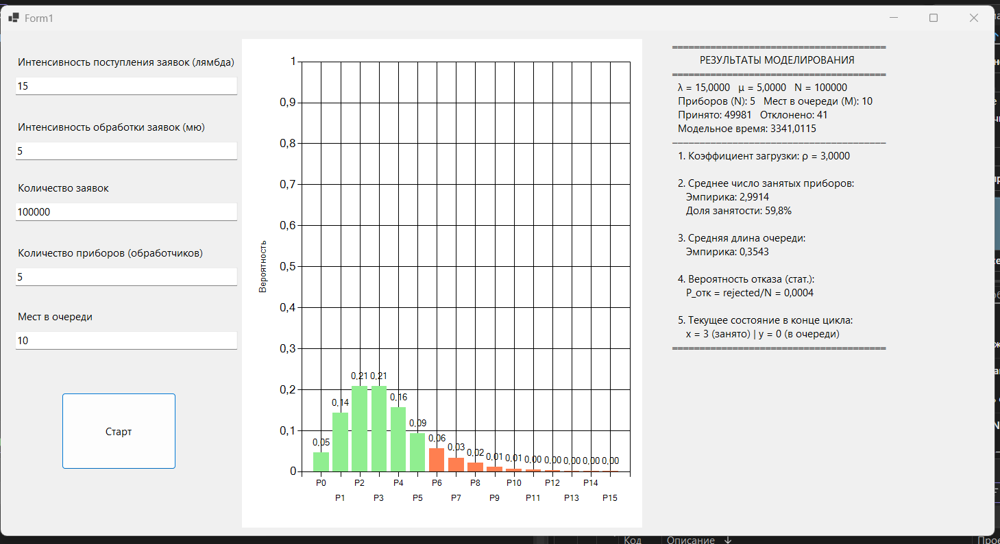

### Система массового обслуживания M/M/N/M
Моделирование многоканальной СМО с ограниченной очередью

Использовать метод следующего события для моделирования системы массового обслуживания M/M/N/M, где:
- простейший входящий поток с интенсивностью λ
- время обслуживания на каждом приборе распределено экспоненциально с параметром μ
- $N$ параллельных обслуживающих приборов
- очередь ограниченной емкости $M$ (заявка получает отказ, если заняты все приборы и все места в очереди)

- определить эмпирические вероятности состояний $P_k$ (нахождение $k$ заявок в системе)
- вычислить среднее число занятых приборов и среднюю длину очереди
- рассчитать статистическую вероятность отказа системы $P_{отк}$
- визуализировать распределение вероятностей состояний на гистограмме

## Используемые параметры

| Параметр | Значение | Описание |
|---|---|---|
| λ | 15 | Интенсивность поступления заявок |
| μ | 5 | Интенсивность обслуживания одного прибора |
| N | 5 | Количество параллельных приборов |
| M | 10 | Максимальное количество мест в очереди |
| Количество заявок | 100000 | Число обрабатываемых событий цикла |
| Seed | ticks | Зерно мультипликативного генератора |

## Результаты моделирования

| Характеристика | Эмпирическое значение | Расчетная формула / Описание |
|---|---|---|
| Коэффициент загрузки ρ | 3,0000 | λ / μ |
| Принято заявок | 49981 | Количество обслуженных приборами и очередью заявок |
| Отклонено заявок | 41 | Количество заявок, получивших отказ из-за отсутствия мест |
| Модельное время | 3341,0115 | Суммарное накопленное время работы модели |
| Среднее число занятых приборов | 2,9914 | Математическое ожидание числа занятых каналов |
| Доля занятости оборудования | 59,8% | (Среднее число занятых приборов / N) × 100% |
| Средняя длина очереди | 0,3543 | Математическое ожидание числа заявок в очереди |
| Вероятность отказа $P_{отк}$ | 0,0004 | rejected / totalRequests |
| Текущее состояние (конечный шаг) | x = 3, y = 0 | Состояние в конце цикла (3 занятых прибора, 0 в очереди) |

---

## Выводы

1. **Эффективность ограниченной очереди.** Введение лимитированной очереди размером $M = 10$ при коэффициенте загрузки $\rho = 3,0$ показало высокую надежность функционирования системы. Из 100 000 поданных заявок отказ получили всего 41, что соответствует крайне низкой вероятности потери заявки ($P_{отк} = 0,0004$). Это подтверждает, что емкости накопителя достаточно для компенсации случайных пиков входящего потока.

2. **Распределение состояний системы.** Построенная гистограмма распределения вероятностей наглядно отражает специфику СМО вида $M/M/N/M$. Зеленые столбцы демонстрируют вероятности состояний, когда система имеет свободные каналы обслуживания, а коралловые столбцы фиксируют состояния ожидания в очереди. Наиболее вероятным является нахождение в системе 2–3 заявок, в то время как крайние состояния загрузки накопителя стремятся к нулю, обеспечивая стабильность процесса обработки.